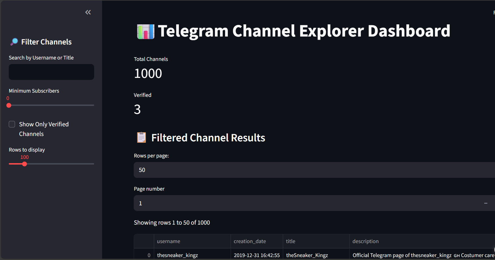

# 📊 Telegram Channel Dashboard

An interactive Streamlit web app to explore Telegram channel metadata, visualize insights, and analyze trends in one place. Built with **Python**, **Pandas**, and **Streamlit**.

---

## 🚀 Live Demo
🔗 [Click here to view the app](https://telegramchanneldashboard.streamlit.app)

-----
## 📌 Features
- 📈 Interactive charts using **Matplotlib**
- 🔍 Filter and explore data dynamically
- 🌐 Simple, clean, and responsive dashboard

## 🛠️ Tech Stack
- Python
- Stramlit
- Pandas
- Matplotlib, Seaborn, for Visualizations

## 📂 Project Structure
```telegram-dashboard/
├── telegram_dashboard.py
├── requirements.txt
├── small_channel_metadata.csv
├── README.md
└── .gitignore
```
## 📸 Screenshot



## 👩‍💻 Author
SHIPALI<br>
📧 shipalibhandary@gmail.com
